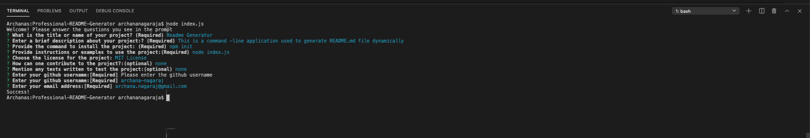
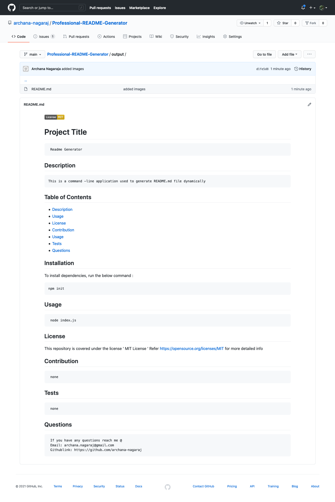

# Professional README Generator

## Description

This project is a command-line application that dynamically generates a professional README.md file from a user's input using the Inquirer package. When the application runs, it presents a series of prompts in the command line to the user to fill in different sections in the README. Once the user is done answering all the questions, the final readme is generated and stored in the output folder.

## Table of Contents

* [Description](#description)
* [Demonstration](#demonstration)
* [Technologies](#technologies)
* [Installation](#installation)
* [Usage](#usage)
* [License](#license)
* [Questions](#questions)

### Demonstration

Demo video: [Professional README Generator Demo](https://drive.google.com/file/d/1UjqaENPhlYIMao5IW-FpiURSwRQk2Zpt/view)

### Output Readme

## Technologies

* [Node.js](https://nodejs.org/)
* [Inquirer.js](https://www.npmjs.com/package/inquirer)

## Installation

To install dependencies, run the following:

      
      npm init
      npm install inquirer
      

## Usage

After installing the dependencies, run the application with 

      node index.js

## License

This repository is licensed under the [MIT license](./LICENSE).

## Questions

For any questions about the project/repository please contact me @ [archana.nagaraj@gmail.com](mailto:archana.nagaraj@gmail.com)  
GitHub @ [archana-nagaraj](https://github.com/archana-nagaraj) 
